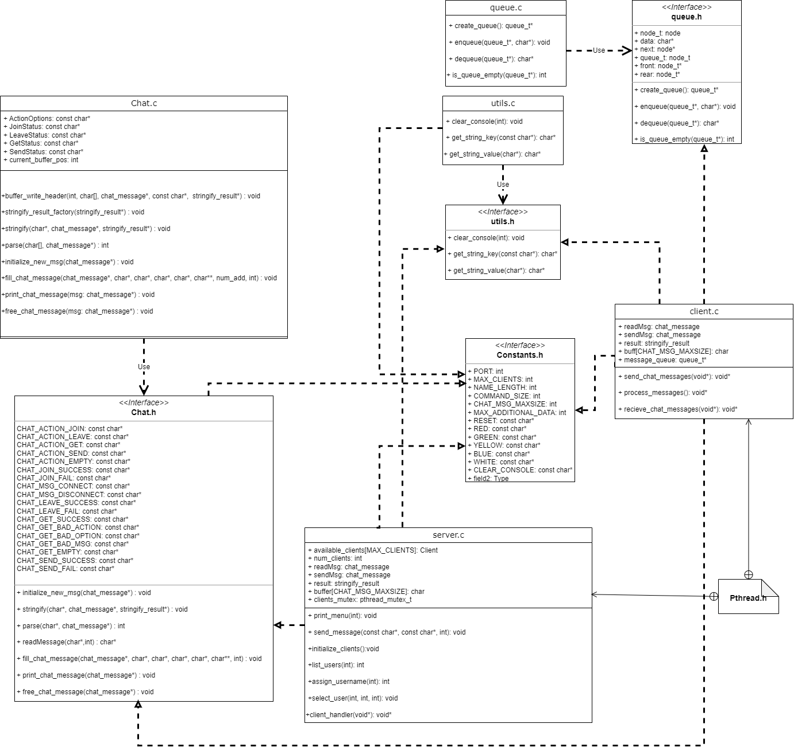

# MY CHAT PROTOCOL
---

## Collaborators
> Juan Andrés Montoya
>
> José Alejandro Tordecilla

## CONTENTS

- [Introduction](#Introduction)
- [Development](#Development)
- [Man pages](#man-pages)
- [Achievements and difficulties](#Achievements-and-difficulties)
- [Conclusions](#Conclusions)
- [References](#References)

---
# Explanatory video


# Introduction

This project aims to apply the concepts learned in the telematics course thus far. Building upon the TCP/IP model, this work focuses on the transport and application layers. The transport layer is implemented using the Berkeley sockets API [1], while the application layer is designed through a custom protocol developed by our team. The primary objective of this project is to implement a client-to-client chat system that later will be uploaded in AWS services.

[1]: https://en.wikipedia.org/wiki/Berkeley_sockets "Berkeley Sockets"


       +------------------+
       |   Application     |
       |      Layer        |
       +------------------+
               |
       +------------------+
       |   Transport       |
       |      Layer        |
       |   (TCP/UDP)      |
       +------------------+
               |
       +------------------+
       |    Internet       |
       |      Layer        |
       |  (IP, ICMP, etc.) |
       +------------------+
               |
       +------------------+
       |   Link Layer      |
       | (Ethernet, Wi-Fi) |
       +------------------+

# Objectives

- **Develop a client-server chat application:** Implement both the client and server sides using a custom communication protocol designed for this project.

- **Implement an application layer protocol:** Design and develop a robust protocol for transmitting text messages between the client and server, allowing for future extensibility.

- **Utilize the sockets API:** Communication between the client and server will be conducted using sockets, facilitating effective data transmission.

- **Support multiple concurrent connections:** The server must handle multiple client connections simultaneously, enabling different pairs of clients to communicate without interference.


# Development

For this activity, we chose to use TCP instead of UDP primarily due to its dedicated native error control. TCP ensures that packets arrive in the order they are sent, which is essential for maintaining the coherence of messages. This characteristic is crucial for ensuring a smooth and fluid conversation. Below is a comparative table that illustrates these differences in more detail.


### TCP vs UDP

| Factor                    | TCP                                                    | UDP                                                      |
|---------------------------|--------------------------------------------------------|----------------------------------------------------------|
| **Connection Type**       | Requires a connection to be established before data transmission | No connection needed to start and end data transfer      |
| **Data Sequencing**       | Can sequence data (send in a specific order)          | Cannot sequence or order data                             |
| **Data Retransmission**   | Can retransmit data if packets do not arrive          | No retransmission of data. Lost data cannot be recovered  |
| **Delivery**              | Delivery is guaranteed                                  | Delivery is not guaranteed                                |
| **Error Checking**        | Extensive error checking ensures data arrives intact   | Basic error checking may not catch all errors            |
| **Broadcasting**          | Not supported                                          | Supported                                                |
| **Speed**                 | Slower, but delivers complete data                     | Faster, but there is a risk of incomplete data delivery   |

For more information, visit [Avast - TCP vs UDP](https://www.avast.com/es-es/c-tcp-vs-udp-difference#:~:text=La%20principal%20diferencia%20entre%20el,fiable%20pero%20funciona%20m%C3%A1s%20r%C3%A1pido.)


## Project core


### How Do We Support Multiple Concurrent Connections?

This project employs a multithreaded architecture to facilitate multiple concurrent connections. Upon establishing a connection, each client is allocated a dedicated space on the server’s disk. This design ensures that each client operates independently, allowing the server to effectively manage simultaneous connections without interference. By leveraging threads, the server can handle multiple client requests in parallel, thereby enhancing the overall responsiveness and performance of the chat application.

### How Do Clients Achieve Communication with Each Other?

The communication process between clients is managed through a syntactical framework consisting of two primary functions. When a client intends to send a message, it is first formatted using the `stringify` function. This function prepares the message for transmission by converting it into a standardized format. Upon receipt of the message, the client employs a `parse` function to decompose the incoming data back into a comprehensible structure. 

An essential intermediary step occurs on the server, where it reads the incoming request to identify and verify the intended recipient of the message. The server's `client_handler` method plays a crucial role in this communication process. It assesses the input packet and determines the appropriate response or action to take based on the content and context of the message. This method ensures that the server effectively manages the flow of information between clients, maintaining the integrity and reliability of the communication channel.


### UML



### Protocol Syntax

Our message is build with the following structure:


```bnf
<protocol> ::= <MCP> / <VERSION> / <METHOD> / CODE:<STATUS_CODE> / <ADDITIONAL_DATA> / MSG: <message_text>

<MCP> ::= "MCP"
<VERSION> ::= <version_number>
<METHOD> ::= GET | JOIN | SEND | LEAVE
<STATUS_CODE> ::= 0 ... 404
<ADDITIONAL_DATA> ::= <KEY> ":" <VALUE> 
                   | "/" <ADDITIONAL_DATA> {1..9}
<message_text> ::= <text_content>
```


| Component        | Definition                                                                 |
|------------------|----------------------------------------------------------------------------|
| `<protocol>`     | The full message format, composed of MCP, version, method, status code, additional data, and message. |
| `<MCP>`          | Constant string "MCP".                                                     |
| `<VERSION>`      | Version number, specified as `<version_number>`.                           |
| `<METHOD>`       | Defines the action: `GET`, `JOIN`, `SEND`, `LEAVE` or `...`(Safe intended).                     |
| `<STATUS_CODE>`  | Status code ranging from `0` to `404`.                                     |
| `<ADDITIONAL_DATA>` | Key-value pairs or up to 10 additional data elements. Example: `key: value`. Each one separated by backslash. Possible values:|
||E_MTD:`<METHOD>`<br>|
| `<message_text>` | Actual text content of the message.                                        |


# Man pages

## SECTIONS:

### [chat.c](#chatc)
- [buffer_write_header](#buffer_write_header)
- [stringify_result_factory](#stringify_result_factory)
- [stringify](#stringify)
- [parse](#parse)
- [initialize_new_msg](#initialize_new_msg)
- [fill_chat_message](#fill_chat_message)
- [print_chat_message](#print_chat_message)
- [free_chat_message](#free_chat_message)

### [server.c](#serverc)
- [initialize_clients](#initialize_clients)
- [debug_message](#debug_message)
- [send_message](#send_message)
- [printMenu](#printmenu)
- [assign_username](#assign_username)
- [list_users](#list_users)
- [select_user](#select_user)
- [disconnect_user](#disconnect_user)
- [client_handler](#client_handler)

### [client.c](#clientc)
- [send_chat_messages](#send_chat_messages)
- [process_messages](#process_messages)
- [receive_chat_messages](#receive_chat_messages)

### [utils.c](#utilsc)
- [clear_console](#clear_console)
- [get_string_key](#get_string_key)
- [get_string_value](#get_string_value)

### [queue.c](#queuec)
- [create_queue](#create_queue)
- [enqueue](#enqueue)
- [dequeue](#dequeue)
- [is_queue_empty](#is_queue_empty)
  
## Chat.c:

## `buffer_write_header`

`
void buffer_write_header(int isAction, char buffer[], struct chat_message *msg, const char *methodStatus[], struct stringify_result *result)
`
### Description
Writes the header information into a buffer based on the action or status of a chat message.

### Parameters
- `isAction`: An integer (1 or 0) determining whether to process the action or the status of the message.
- `buffer[]`: A character array where the header will be written.
- `msg`: A pointer to a `chat_message` structure that contains the message information.
- `methodStatus[]`: An array of status strings to compare with the message.
- `result`: A pointer to `stringify_result` where the result of the operation is stored.

---

## `stringify_result_factory`
`
void stringify_result_factory(struct stringify_result *result)
`
### Description
Initializes a `stringify_result` structure by setting the default length and reply values.

### Parameters
- `result`: A pointer to a `stringify_result` structure that will be initialized.

---

## `stringify`
`
void stringify(char *buffer, struct chat_message *msg, struct stringify_result *result)
`
### Description
Generates a string representation of the `chat_message` and writes it into a buffer.

### Parameters
- `buffer`: A character array where the stringified message will be written.
- `msg`: A pointer to a `chat_message` structure that contains the message information.
- `result`: A pointer to a `stringify_result` where the result of the operation is stored.

---

## `parse`
`
int parse(char buffer[], struct chat_message *msg)
`
### Description
Parses a buffer string and fills the fields of a `chat_message` structure.

### Parameters
- `buffer`: A character array containing the message to be parsed.
- `msg`: A pointer to a `chat_message` structure where the parsed information will be stored.

### Returns
- `0` if the parsing is successful.
- `-1` if there is an error.

---

## `initialize_new_msg`

`
void initialize_new_msg(struct chat_message *newMsg)
`
### Description
Initializes a new `chat_message` structure and allocates memory for its fields.

### Parameters
- `newMsg`: A pointer to a `chat_message` structure that will be initialized.

---

## `fill_chat_message`
`
void fill_chat_message( struct chat_message *msg, char *protocolVersion, char *action, char *status, char *message, char *additionalData[], int num_additionalData) 
`

### Description
Fills a `chat_message` structure with the provided information.

### Parameters
- `msg`: A pointer to the `chat_message` structure that will be filled.
- `protocolVersion`: A string representing the protocol version.
- `action`: A string representing the action of the message.
- `status`: A string representing the status of the message.
- `message`: A string representing the message body.
- `additionalData[]`: An array of additional data related to the message.
- `num_additionalData`: The number of additional data items.

---

## `print_chat_message`
`
void print_chat_message(struct chat_message *msg)
`

### Description
Prints the content of a `chat_message` structure to the console.

### Parameters
- `msg`: A pointer to the `chat_message` structure to be printed.

## `free_chat_message`
`
void free_chat_message(struct chat_message *msg
`

### Description
Frees the dynamically allocated memory used by a `chat_message` structure, including its fields and any additional data. After freeing, it sets the relevant pointers to `NULL` to avoid dangling references.

### Parameters
- `msg`:  
  A pointer to a `struct chat_message` that contains the data to be freed.


## Server.c

## `initialize_clients`
`
void initialize_clients()
`

## Description
Initializes the available clients for connection handling in the application.

The function performs the following tasks for each client in the `available_clients` array:
- Sets the socket file descriptor (`sockfd`) to `-1`, indicating that the socket is not connected.
- Sets the paired client identifier (`paired`) to `-1`, indicating that there is no paired client.
- Sets the `is_first_connection` flag to `true`, marking that this is the first connection attempt for the client.
- Clears the username field using `memset` to ensure it is empty.

### Parameters
- None.

## `debug_message`
`
void debug_message(char *buffer, struct chat_message *msg)
`

## Description
Prints a debug message to the console, including the contents of a buffer and a `chat_message` structure. It outputs a separator, the buffer's content, the details of the `chat_message`, and concludes with another separator line for clarity.

### Parameters
- `buffer`: A pointer to a character array (string) that contains the debug message.
- `msg`: A pointer to the `chat_message` structure to be printed for debugging.

## `send_message`
`
void send_message(int sockfd, char *version, char *action, char *code, char *message, char *aditionalData[], int aditionalDataCount)
` 

## Description
Sends a formatted message over a socket connection. This function initializes a new message, fills it with the provided parameters, converts it to a string, and writes it to the specified socket. It also handles memory management by freeing allocated resources after sending the message.

### Parameters
- `sockfd`: An integer representing the socket file descriptor to which the message will be sent.
- `version`: A pointer to a character array (string) indicating the version of the message protocol.
- `action`: A pointer to a character array (string) specifying the action associated with the message.
- `code`: A pointer to a character array (string) representing the status code of the message.
- `message`: A pointer to a character array (string) containing the main content of the message.
- `aditionalData[]`: An array of pointers to character arrays (strings) containing any additional data to be included in the message.
- `aditionalDataCount`: An integer indicating the number of additional data items in the `aditionalData` array.

## `printMenu`
`
void print_menu(int connfd)
`

## Description
Constructs and sends a formatted menu for the chat server to the specified connection. This function builds a static string containing the menu options and then uses the `send_message` function to send this menu to the connected client.

### Parameters
- `connfd`: An integer representing the socket file descriptor for the connection to which the menu will be sent.


## `assign_username`

`
void assign_username(int connfd, int client_index)
`
## Description
Prompts the connected client to assign a username for their session. The function continuously sends a request for a username until a valid input is received. Once a valid username is provided, it updates the corresponding client’s username in the `available_clients` array.

### Parameters
- `connfd`: An integer representing the socket file descriptor for the client connection.
- `client_index`: An integer representing the index of the client in the `available_clients` array.

## `list_users`
`
void list_users(int connfd)
`
## Description
Retrieves and sends a list of available users to the connected client. The function checks for clients that are not paired and sends their usernames. If no users are available, it informs the client accordingly.

### Parameters
- `connfd`: An integer representing the socket file descriptor for the client connection.

## `select_user`
`
void select_user(int connfd, int client_index, int target_client)
`
## Description
Establishes a chat connection between two clients. The function pairs the current client with the target client, allowing them to communicate. If the target client is invalid or already paired, an error message is sent to the current client.

### Parameters
- `connfd`: An integer representing the socket file descriptor for the current client connection.
- `client_index`: An integer representing the index of the current client in the `available_clients` array.
- `target_client`: An integer representing the index of the target client to connect with.

## `disconnect_user`
`
void disconnect_user(int connfd, int client_index, void *connfd_ptr)
`

## Description
Disconnects a user from the chat server. This function updates the state of the user being disconnected and notifies the paired user that the other user has left the chat. It also cleans up the user’s data and decreases the client count.

### Parameters
- `connfd`: An integer representing the socket file descriptor for the user to disconnect.
- `client_index`: An integer representing the index of the user in the `available_clients` array.
- `connfd_ptr`: A pointer to the connection file descriptor, used to exit the thread safely.

## `client_handler`
`
void *client_handler(void *connfd_ptr)
`
## Description
Basically the server core, handles client interactions in the chat server. This function runs in a separate thread for each client, managing user commands and messages. It allows clients to assign usernames, connect with other users, send messages, and disconnect gracefully.

### Parameters
- `connfd_ptr`: A pointer to the connection file descriptor, which identifies the client. It is expected to point to an integer representing the socket file descriptor.


## Client.c
## `send_chat_messages`

`
void* send_chat_messages(void* sockfd_ptr)
` 
### Description
Reads user input from the console, builds a chat message with appropriate headers and message actions, and sends it through the socket. 

- Clear `buff` using `bzero()` and read input with `fgets()`.
- If input starts with "LIST", "MENU", "DISCONNECT", or "CONNECT", pick the respective option and pass it to `fill_chat_message()`.
- Fill message with `fill_chat_message()`, then use `stringify()` and `write()` to send.

### Parameters

- **`sockfd_ptr`**: A pointer to the socket file descriptor that will be cast to an integer (`sockfd`).

## `process_messages`

`
void *process_messages()
`
### Description

Handle incoming messages from a queue, process them, and display the message content.

- The function runs in an infinite loop (`while (1)`), continuously checking for messages in a queue.
- It checks if there are any messages in the `message_queue` using `is_queue_empty(message_queue)`.
- If a message is found, the function attempts to parse the message using `parse(message, &readMsg)`.
- Prints the parsed message content using `printf()` with a specific format (in this case, the message is displayed in blue).
- Frees the allocated memory for the message using `free(message)`.

## `receive_chat_messages`
`
void* receive_chat_messages(void* sockfd_ptr) 
`
### Description

Responsible for receiving chat messages from a server and storing them in a queue for further processing.
- Declare `recv_buff`, a buffer to store the received message. The size is defined by `CHAT_MSG_MAXSIZE`.
- Use `bzero()` to clear `recv_buff` before reading new data.
- Use `read()` to read data from the server socket into `recv_buff`.
- If a message is successfully read, duplicate the message using `strdup()` to create a safe copy and add it to`message_queue` using `enqueue()`.

## Utils.c

## `clear_console`
`
void clear_console(int connfd)
`
### Description
Sends an ANSI escape sequence to the client to clear the console screen. The function writes the sequence through a socket connection.

### Parameters
- `connfd`: A file descriptor for the client's socket connection, used to send the ANSI escape sequence to the client.

## `get_string_key`
`
char* get_tring_key(const char *string)
`
### Description
Extracts the key from a `KEY:VALUE` formatted string. The function identifies the position of the colon (`:`) and returns the part before the colon as the key. Memory is dynamically allocated for the key, and the caller is responsible for freeing it.

### Parameters
- `string`:  
  A pointer to a null-terminated string in the `KEY:VALUE` format. The function extracts and returns the part before the colon as the key. If the string is `NULL` or does not contain a colon, the function returns `NULL`.


## `get_string_value`
`
char* get_string_value(char *string)
`
### Description
Extracts the value from a `KEY:VALUE` formatted string. The function finds the position of the colon (`:`) and returns a newly allocated string containing the part after the colon.

### Parameters
- `string`:  
  A pointer to a null-terminated string in the `KEY:VALUE` format. The function extracts and returns the part after the colon as the value. If the string is `NULL` or does not contain a colon, the function returns `NULL`.

## Queue.c
## `create_queue`
`
queue_t* create_queue()
`
### Description
Initializes and returns a pointer to a new, empty queue. The queue's front and rear pointers are initialized to `NULL`.

### Parameters
None.

## `enqueue`
`
void enqueue(queue_t *q, char *msg)
`
### Description
Adds a message to the end of the queue. If the queue is empty, the new node becomes both the front and rear of the queue. The message is duplicated before being added.

### Parameters
- `q`:  
  A pointer to a `queue_t` structure representing the queue.
  
- `msg`:  
  A pointer to a null-terminated string containing the message to be enqueued. The message is duplicated and stored in the new node.

## `dequeue`
`
char* dequeue(queue_t *q)
`
### Description
Removes and returns the message from the front of the queue. If the queue becomes empty after dequeuing, both the front and rear pointers are set to `NULL`. The message is returned, but the caller is responsible for freeing the memory allocated for the message.

### Parameters
- `q`:  
  A pointer to a `queue_t` structure representing the queue.

## `is_queue_empty`
`
int is_queue_empty(queue_t *q) 
`
### Description
Checks whether the queue is empty by examining if the front pointer is `NULL`.

### Parameters
- `q`:  
  A pointer to a `queue_t` structure representing the queue.

### Return Value
- Returns `1` if the queue is empty (i.e., the front pointer is `NULL`), otherwise returns `0`.


# Achievements and difficulties

The project managed to extinguish the little love we had left for education. It was something very basic at the telecommunications level, but the number of errors we encountered made it difficult. Starting with memory management errors in C, pointers, and SEGMENTATION FAULT, it became very challenging to work with programming at such a low level. Building the protocol from scratch meant thinking ahead about how we wanted the functionalities to grow, and since we didn't plan this well from the beginning, it changed many times. There are many functionalities we had in mind that were left unimplemented because time was limited; we spent more time fixing errors than creating functionalities.


 
 
Despite everything, we managed to get the clients to communicate with each other using the syntax we defined in each of their messages. Initially, only one message could be sent at a time, which made the order of messages very strange, with some disappearing and others getting stuck in the buffer. With the help of threads and queues, we were able to implement a chat that supports multiple messages in succession. The scalability of our protocol lies in the additionalData, which can receive a variety of data depending on the needs, although for this submission, we only specified the expected method to be returned.

We effectively achieved the simultaneous connection of several chat lines, and overall, we met the objectives.


# Conclusions


In conclusion, the development of the client-client chat system has successfully demonstrated the application of the telematics course concepts, especially in the implementation of the TCP/IP model. By using the Berkeley Sockets API for the transport layer and designing a custom protocol for the application layer, the project achieved its goals of creating a robust chat application capable of handling multiple concurrent connections. The choice of TCP over UDP ensured reliable and orderly message delivery, essential for efficient communication. In addition, the multithreaded architecture allows for independent client operations while maintaining a smooth exchange of messages through a structured protocol. Overall, the project highlights the importance of a solid architecture and protocol design in creating efficient communication systems.


# References

> [Beej's Guide to Network Programming](https://beej.us/guide/bgnet/)

> [Beej's Guide to C Programming](https://beej.us/guide/bgc/)

> [TCP Server-Client implementation in C](https://www.geeksforgeeks.org/tcp-server-client-implementation-in-c/)

> [Threads, Mutexes and Concurrent Programming in C](https://www.codequoi.com/en/threads-mutexes-and-concurrent-programming-in-c/)

# Execution

**Compile Server**

To compile the server, use the following command:

```bash
gcc -g -o server server.c app_layer/chat.c utils.c -lpthread
```

**Execute server**

```./server```

**Compile client**

 ```bash
 gcc -g -o client client.c app_layer/chat.c utils.c constants.h queue.c -lpthread
 ```
 
 **Execute client**
 
 ```./client```
 
> [Go back to contents](#MY-CHAT-PROTOCOL)
